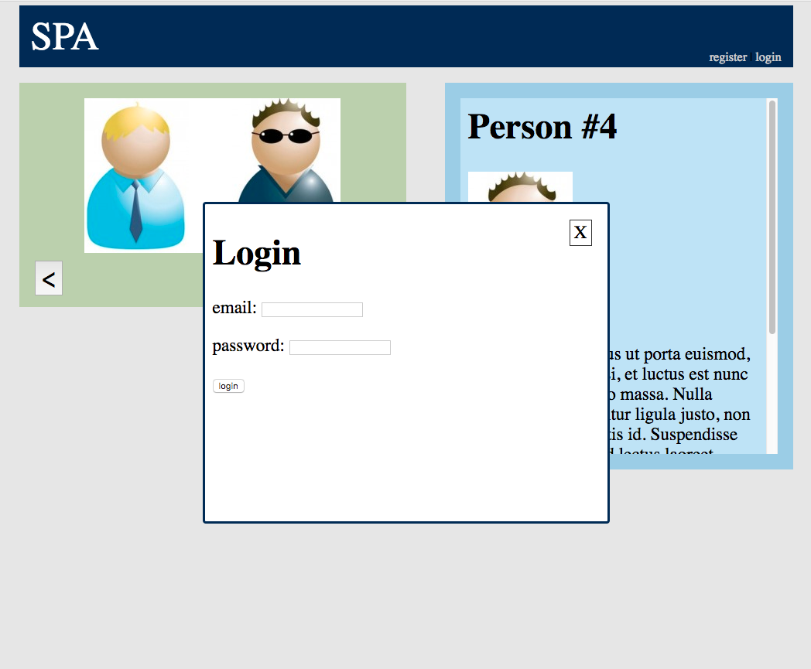
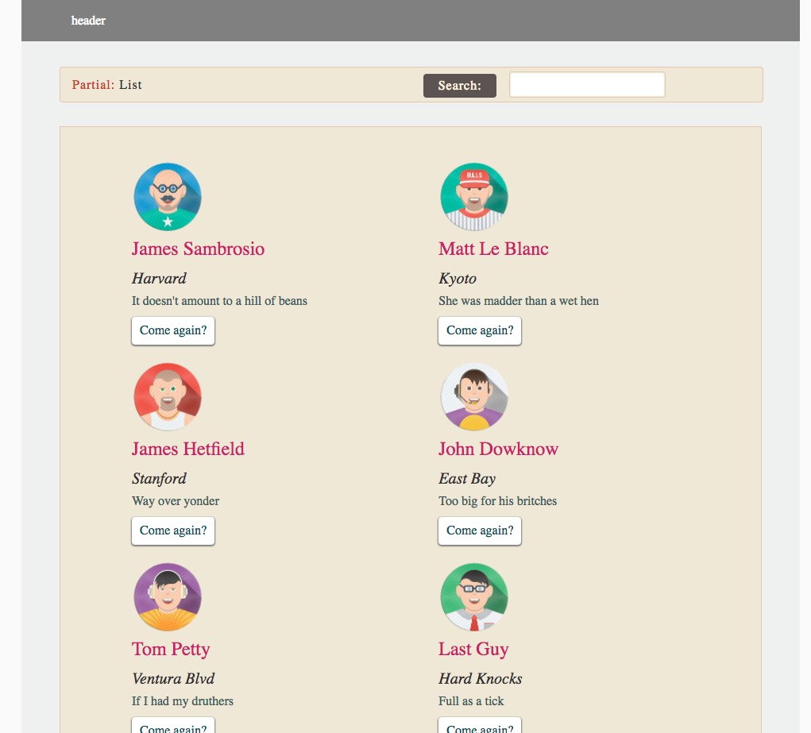

### <kbd>notes: &nbsp; :boom:</kbd>

- ngRoute         => app as part of building routes
- $routeParams    => controller details partial
- $routeProvider  => as part of app.config
- #!/              => in case your version of angular does url encoding differently
                     
- /#!              => (page back)

> ajax-js-task is a separate folder (ref1)

### ref pics

<kbd>ref1</kbd>

<kbd>ref2</kbd>

